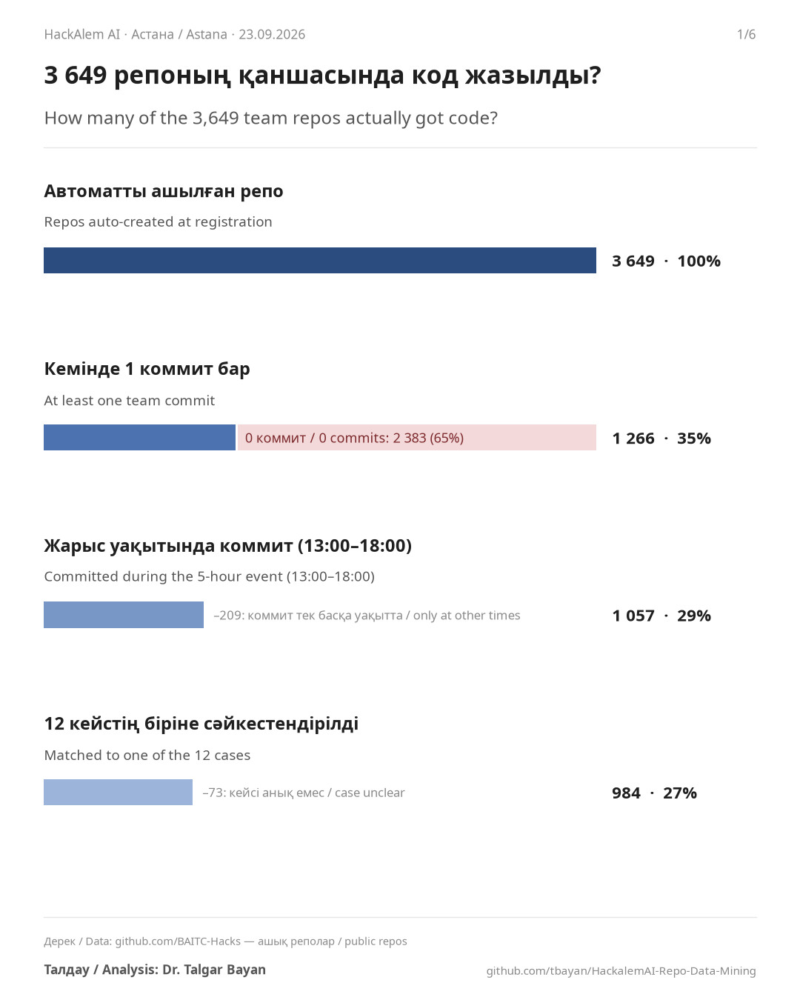
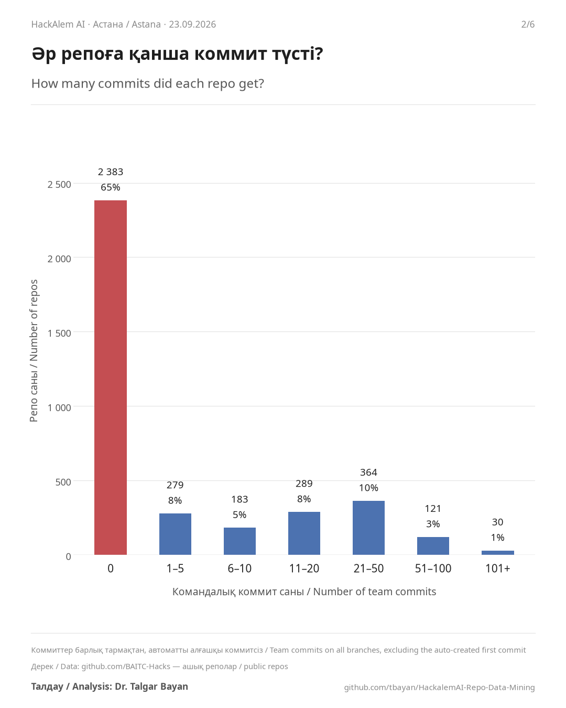
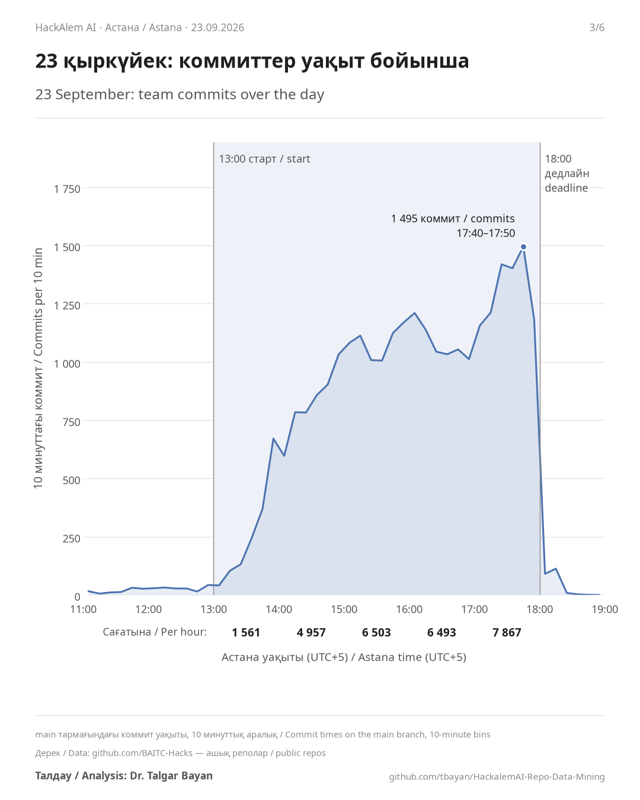
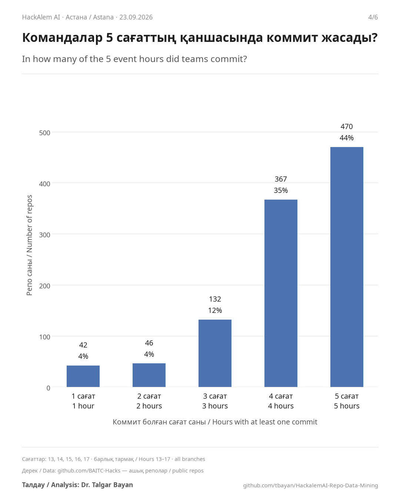
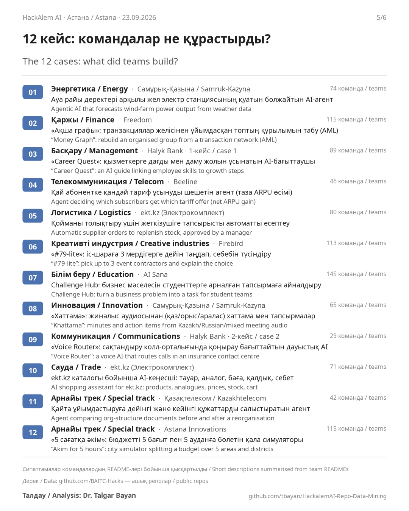
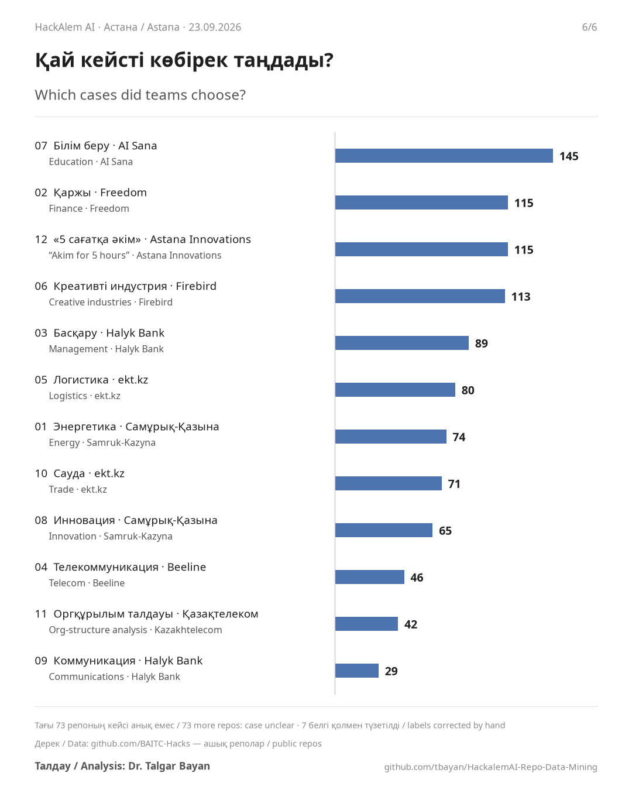

<p align="center"><a href="README.md">🇰🇿 Қазақша</a> · <b>🇬🇧 English</b></p>

# HackAlem AI 2026: what 3,649 team repos tell us

**Author:** Dr. Talgar Bayan · **Date:** 24 September 2026 · **Data:** public GitHub repos of the [BAITC-Hacks](https://github.com/BAITC-Hacks) organisation

> **Disclaimer.** All data comes from public GitHub repositories. No personal data of participants was analysed, and none is published in this repo: it holds only aggregate numbers and charts. These are not the official results of the hackathon. Details: [section 7](#7-disclaimer).

## Summary

- Every registered team got an auto-created GitHub repo: **3,649 repos** in total.
- **2,383 repos (65.3%) are empty:** they have no team commits at all.
- **1,057 repos (29.0%)** have commits during the event (13:00–18:00).
- The busiest hour was the last one: **7,867 commits between 17:00 and 18:00**. Activity stopped sharply at 18:00.
- **79%** of the teams that committed during the event did so in at least four of the five hours.
- The most chosen of the 12 cases was **AI Sana's education case (145 teams)**; the least chosen was **Halyk Bank's "Voice Router" (29)**.

## Contents

1. [About the hackathon](#1-about-the-hackathon)
2. [Repos and commits](#2-repos-and-commits)
3. [Timing and working rhythm](#3-timing-and-working-rhythm)
4. [The 12 cases](#4-the-12-cases)
5. [Method](#5-method)
6. [Limitations](#6-limitations)
7. [Disclaimer](#7-disclaimer)
8. [Reproduce](#8-reproduce)
9. [Sources](#9-sources)
10. [Author](#10-author)

## 1. About the hackathon

- **When and where:** 23 September 2026, Astana, in person. Coding window: 13:00–18:00 (five hours).
- **Teams:** up to three people; solo entries were allowed. Using Codex during development was required.
- **Seats:** 6,586 applications for 2,500 seats. There were long queues at the entrance, and some registered people could not get in, which the organisers acknowledged.
- **Results:** judging 24–28 September, Demo Day 29 September, awards 1 October.
- **GitHub:** every registered team got an auto-created repo named `hack-<id>-<team-name>` in the BAITC-Hacks organisation. After 18:00 the repos were archived (read-only).

## 2. Repos and commits

### 2.1. Two in three repos stayed empty



2,383 of the 3,649 repos (65.3%) have no team commits at all. 1,266 have at least one commit. 1,057 (29.0%) have commits during the event (13:00–18:00). Another 209 have commits, but those were made before the event started. Of the repos with event-time commits, 984 (93.1%) were matched to one of the 12 cases.

**An empty repo does not mean a lazy team.** There were 2,500 seats for 6,586 applications, and some people queued and never got in. Some teams appear to have registered more than once: 225 team names appear on more than one repo. The data cannot tell these reasons apart.

### 2.2. Commit levels



Among repos with commits, the most common level is 21–50 commits (364 repos); 30 repos have more than 100. The median repo with at least one commit has 16 commits. Counts include all branches and exclude the auto-created first commit.

## 3. Timing and working rhythm

### 3.1. Commits over the day



Commits rose quickly after 13:00, stayed high through the afternoon, and peaked in the final hour: 7,867 commits between 17:00 and 18:00, or 28.7% of event-time commits on main branches. The busiest ten minutes were 17:40–17:50 (1,495 commits). Activity stopped sharply at 18:00, and 3,201 repos were archived between 18:01 and 18:51.

### 3.2. How steadily did teams work?



Of the 1,057 repos with commits during 13:00–18:00, 470 (44.5%) committed in every one of the five hours and 837 (79.2%) in at least four. At least 996 (94.2%) committed in the final hour (17:00–18:00). Most teams that started working kept going to the end.

## 4. The 12 cases

### 4.1. What were the cases?



| No. | Sector | Partner | Task | Teams |
|---|---|---|---|---:|
| 01 | Energy | Samruk-Kazyna | Agentic AI that forecasts wind-farm power output from weather data | 74 |
| 02 | Finance | Freedom | "Money Graph": rebuild an organised group from a transaction network (AML) | 115 |
| 03 | Management | Halyk Bank (case 1) | "Career Quest": an AI guide linking employee skills to growth steps | 89 |
| 04 | Telecom | Beeline | Agent deciding which subscribers get which tariff offer (net ARPU gain) | 46 |
| 05 | Logistics | Elektrokomplekt (ekt.kz) | Automatic supplier orders to replenish stock, approved by a manager | 80 |
| 06 | Creative industries | Firebird | "#79-lite": pick up to 3 event contractors and explain the choice | 113 |
| 07 | Education | AI Sana | Challenge Hub: turn a business problem into a task for student teams | 145 |
| 08 | Innovation | Samruk-Kazyna | "Khattama": minutes and action items from Kazakh/Russian/mixed meeting audio | 65 |
| 09 | Communications | Halyk Bank (case 2) | "Voice Router": a voice AI that routes calls in an insurance contact centre | 29 |
| 10 | Trade | Elektrokomplekt (ekt.kz) | AI shopping assistant for ekt.kz: products, analogues, prices, stock, cart | 71 |
| 11 | Special track | Kazakhtelecom | Agent comparing org-structure documents before and after a reorganisation | 42 |
| 12 | Special track | Astana Innovations | "Akim for 5 hours": city simulator splitting a budget over 5 areas and districts | 115 |

### 4.2. Which cases did teams choose?



The most chosen case was AI Sana's education challenge hub (145 teams), followed by Freedom's "Money Graph" and "Akim for 5 hours" (115 each) and Firebird's contractor matching (113). The least chosen was Halyk Bank's "Voice Router" (29). Another 73 repos with event-time commits could not be matched to a case.

## 5. Method

1. **Repos.** The list of all repos in the BAITC-Hacks organisation came from the GitHub REST API: 3,649 repos, all archived (`src/fetch_repos.py`). Data was collected on the night of 24 September 2026.
2. **Commits.** Commit counts on each repo's main branch (`src/fetch_commit_counts.py`) and commit times (`src/fetch_commit_timings.py`, at most 300 commits per repo) came from GitHub GraphQL.
3. **READMEs.** 3,644 READMEs were downloaded from raw.githubusercontent.com (`src/fetch_readmes.py`); 5 repos have none.
4. **Per-repo table.** `hackalem_repos_analysis.csv` holds, for each repo: team commits (all branches, excluding the auto-created first commit), commits during 13:00–18:00, the number of event hours with commits, and a case label. It was built separately; the script that produced it is not in this repo yet. We checked it against the API data: for 991 of the 1,057 active repos, the hours-with-commits value matches our own count from the main branch exactly; for the rest the table's value is higher, consistent with commits on other branches.
5. **Cases.** We compared the case labels with the README texts using keywords, read the disagreements by hand, and corrected 7 wrong labels (`CASE_FIXES` in `src/plot_bilingual_charts.py`).
6. **Time.** All times are Astana time (UTC+5).
7. **Numbers.** Every number in the charts and in this README is computed by `src/plot_bilingual_charts.py` and written to `charts/bilingual/facts.json`.

## 6. Limitations

- One repo is one registration (a team), not a person. Teams had up to three members, so head-counts can't be derived from this data.
- The data can't say why a repo is empty: the team may not have come, may not have got in, may have registered twice, or may have coded elsewhere.
- Commit count measures neither quality nor effort.
- The case labels of 19 repos whose README is still the auto-generated template were not checked.
- The timeline uses main branches only; two repos have more than 300 commits and the excess is not plotted.

## 7. Disclaimer

- All data comes from **public** GitHub repositories of the BAITC-Hacks organisation. No private system was accessed.
- No personal data of participants (names, emails, phone numbers, commit authors) was analysed, and none is **published** in this repo. The repo holds only aggregate numbers, charts and code; the raw collected data (`data/`) is not published.
- This is the author's own analysis, **not the official results** of the hackathon. The jury picks the winners.

## 8. Reproduce

```bash
python -m venv .venv && source .venv/bin/activate
pip install -r requirements.txt
cp .env.example .env              # GITHUB_TOKEN=...
cd src
python fetch_repos.py             # data/repos.csv
python fetch_commit_counts.py     # data/commit_counts.csv
python fetch_commit_timings.py    # data/commit_timestamps.csv
python fetch_readmes.py           # data/readmes/
python plot_bilingual_charts.py   # charts/bilingual/*.png + facts.json
```

`data/` is not in the repo, so collect the data again from the public repos with the scripts above. The last step also needs `hackalem_repos_analysis.csv` (see Method, item 4). The charts need a font with Kazakh letters (Noto Sans or DejaVu Sans).

## 9. Sources

- [hackalem.ai](https://hackalem.ai/): format, 2,500 seats, teams of up to three, Codex required
- [The Astana Times](https://astanatimes.com/2026/09/astana-stages-massive-ai-hackathon-in-guinness-world-records-bid/): 6,000+ registrations, five hours
- [Qumash.kz](https://qumash.kz/news/pyat-chasov-v-ocheredi-uchastniki-hackalem-ai-v-astane-pozhalovalis-na-organizatsiyu/): 6,586 applications, entrance queue
- [Ulys Media](https://ulysmedia.kz/news/81431-simuliator-vyzhivaniia-uchastniki-raskritikovali-hackalem-ai-v-astane/): participants' complaints and the organisers' response
- [github.com/BAITC-Hacks](https://github.com/BAITC-Hacks): the team repos

## 10. Author

Analysis: **Dr. Talgar Bayan**. If you use the charts, please credit:

> Dr. Talgar Bayan, "HackAlem AI 2026: what 3,649 team repos tell us", 2026. github.com/tbayan/HackalemAI-Repo-Data-Mining
